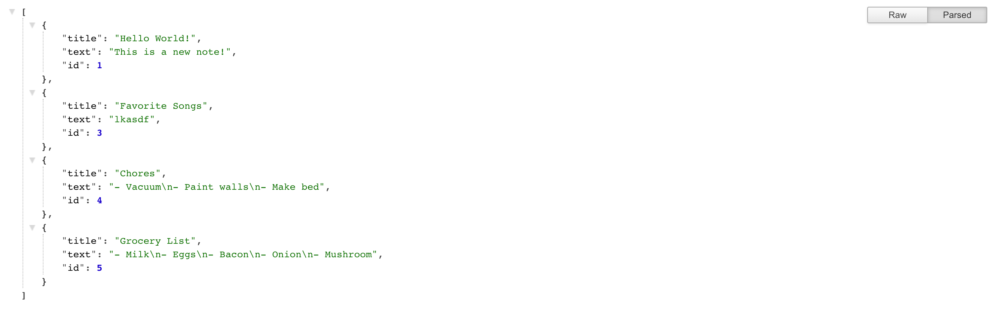

# Note-Keeper

## Description
This app uses Express.js and the File System Module (fs) to read write, display, and delete information based on user interaction.

## Link to Deployed App
https://vast-fortress-44661.herokuapp.com/

## Usage
By following the [deployed Heroku link](https://vast-fortress-44661.herokuapp.com/), you will be presented with a landing page- click the "Get Started button" to be prompted with a new screen.
On the new screen, here's some instruction paths:
* **To begin** fill in the "title" and "text" input areas. When satisfied with entry, click on the save icon in the top right corner to save your new note. You will see a list start to develop on the left side of your screen with correlating title names every time you save a new note.
* **To view** a note, click on the desired title in the left hand column. 
* **To edit** a note, click on the title you want to view, make changes and click the save icon. This will generate a new note that will appear at the bottom of the list on the left.
* **To create** a new note while viewing/ editing an existing or new note, click on the pencil icon in the upper right corner to clear the fields for a new entry.
* **To delete** a note, click on the red garbage can icon to the right of the undesired note.

## Screenshots
### Home page

### Notes page (/notes)

### Raw API page (/api/notes)

## Walkthrough

